# GAZER — Neural Ocular Interface

**Control your whole computer with your eyes.** Look to move the cursor. Blink twice, wink or hold your gaze to click. Glance past the edge of the screen to scroll, go back, open the keyboard or pause. Type on a gaze keyboard that never steals focus. All it needs is a regular webcam.

Gazer runs entirely on your machine and comes with a cinematic 3D **Command Deck**: a live holographic face that mirrors yours, gaze rays hitting a virtual monitor, a head-pose gimbal, and fullscreen calibration with imploding targets.

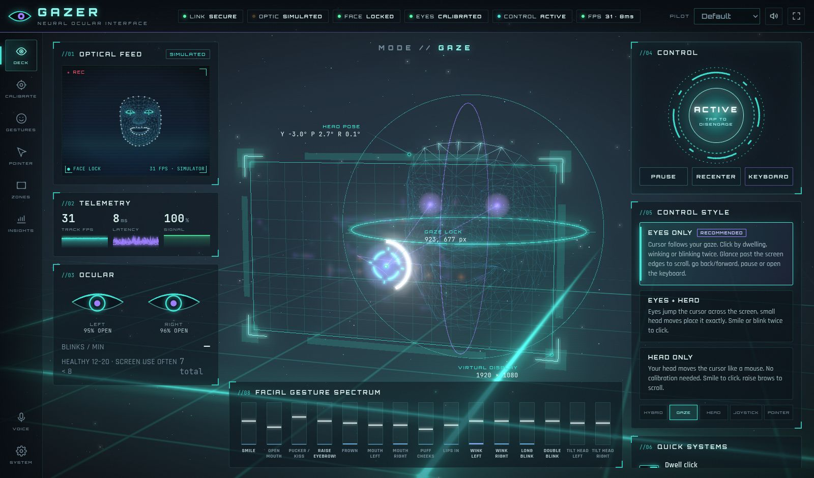

---

## Quick start

```bat
setup.bat                     :: Windows — venv, dependencies, face model, tests
.venv\Scripts\python -m gazer
```

```bash
./setup.sh                    # Linux / macOS
.venv/bin/python -m gazer
```

**No webcam? Try demo mode.** A simulated pilot (a full 478-landmark synthetic face with realistic eye movement) drives the real engine, so every screen works:

```bash
python -m gazer --demo            # desktop app, virtual cursor (your mouse is left alone)
python -m gazer --demo --web      # same, in your browser, no Qt needed
```

On first launch Gazer asks how you want to control it (**Eyes only** is recommended), then runs a ~50 s eye calibration.

## Controlling your PC with your eyes

| You want to… | Eyes-only way | Also possible |
|---|---|---|
| Move the cursor | Look where you want it | Head mouse / joystick / head pointer / hybrid |
| Left click | **Blink twice quickly**, wink left, or hold your gaze still for 1 s (dwell) | Smile, voice "click" |
| Right click | Wink right | Action wheel, voice "right click" |
| Hit a tiny target | Open the **zoom lens** (bottom-left zone or wheel) and click inside the magnified view | Precision mode |
| Scroll | **Look just below the screen** to scroll down, just above to scroll up; keep looking to go faster | Raise brows → scroll mode |
| Back / forward | Glance past the left / right edge | Voice "go back" |
| Everything else | Top-left corner opens the **action wheel**: double-click, right-click, drag, copy, paste, alt-tab… | Gesture bindings, voice |
| Type | Bottom-right corner opens the **gaze keyboard** (with word prediction) | Voice dictation |
| Pause / resume | Long blink (≈1 s), or the top-right corner | Ctrl+Alt+P |
| Fix drift | "Recenter" from the wheel | Ctrl+Alt+R; Gazer also learns from every click |

Natural blinks never click: a double blink needs two complete, deliberate blinks within half a second. The test suite checks that 20 s of normal blinking produces zero clicks.

## The Command Deck

| | |
|---|---|
| 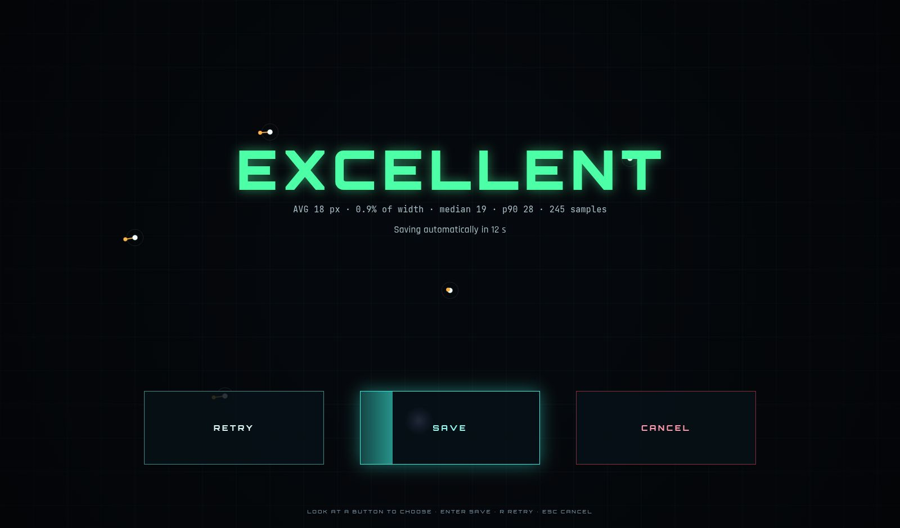 **Calibration**: imploding targets, validation on unseen points, and hands-free SAVE / RETRY by *looking* at a button. | 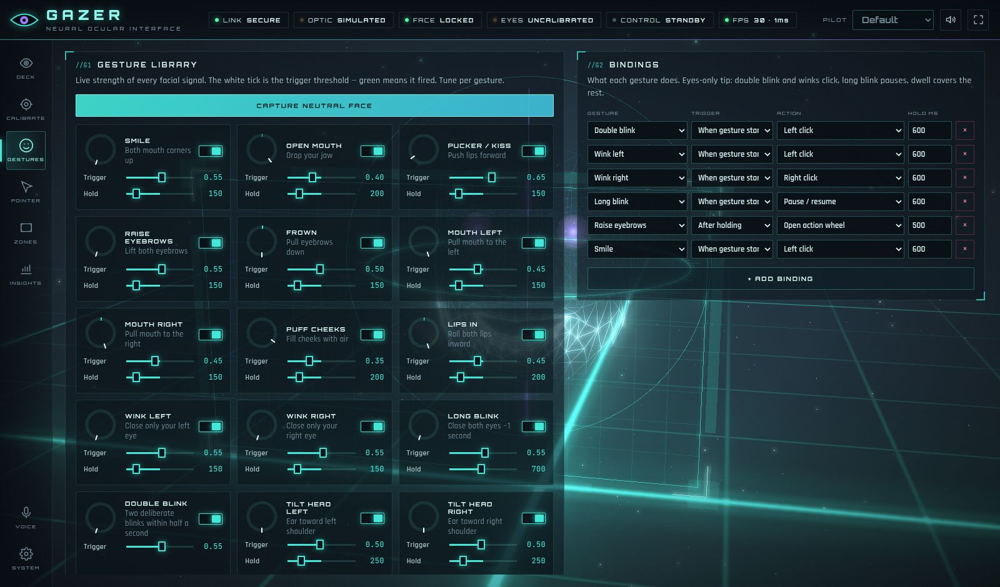 **Gestures**: live strength of 15 facial signals, per-gesture thresholds, and a binding editor. |
| 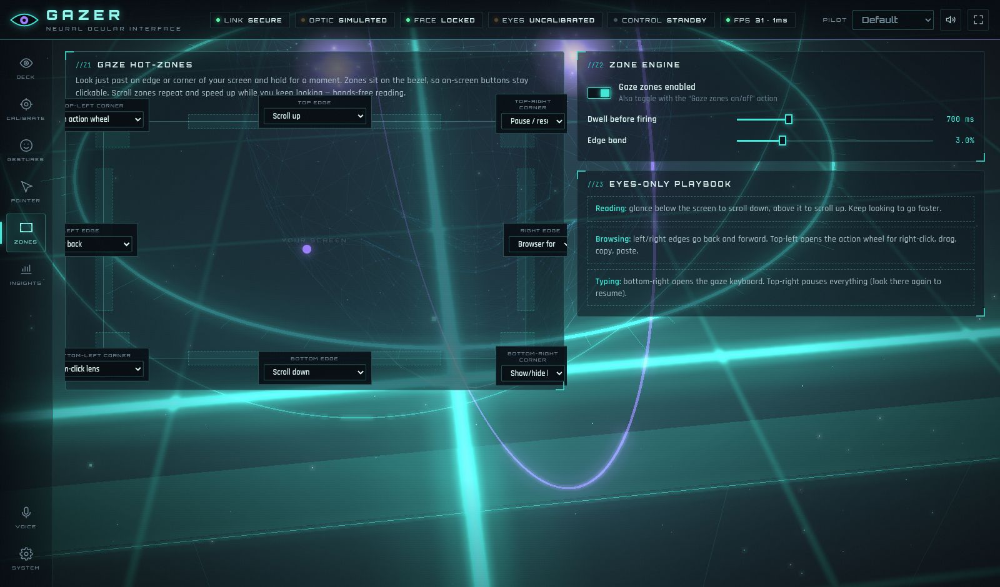 **Gaze zones**: eight hot-zones on the screen border. | 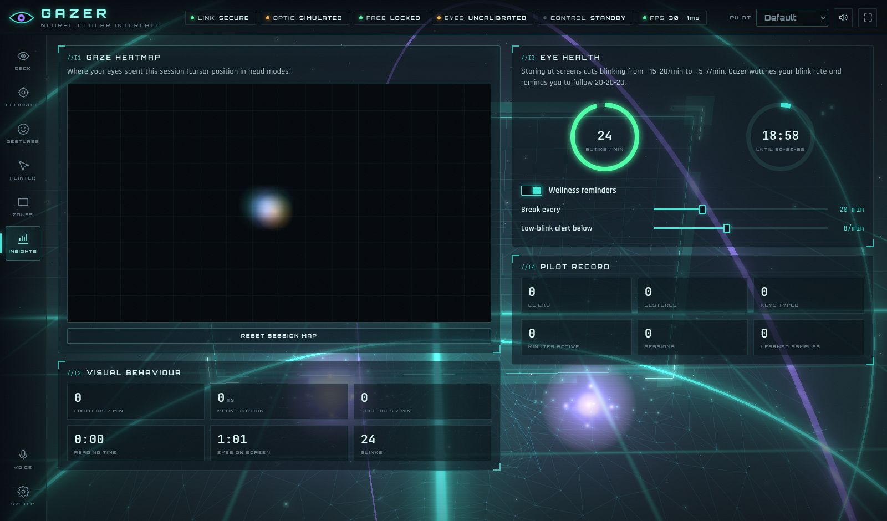 **Insights**: gaze heatmap, fixations, reading time, blink rate, and 20-20-20 break reminders. |
| 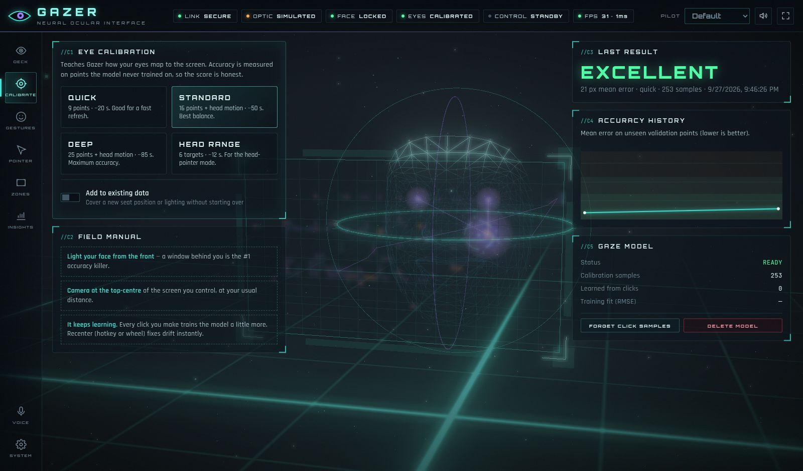 **Calibrate**: presets, accuracy history, and model management. | 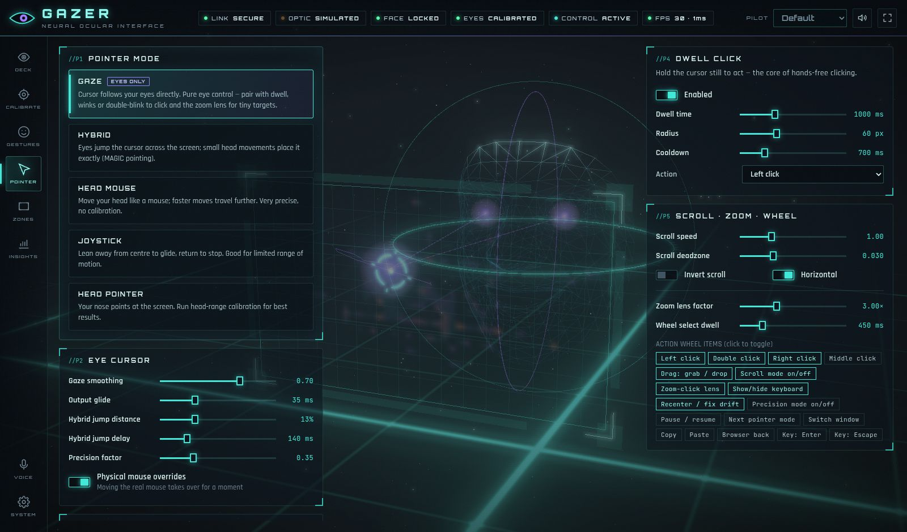 **Pointer**: five pointing modes, dwell, scroll, zoom, and the action wheel. |

On the desktop itself, a click-through HUD overlay draws the reticle, dwell arc, zone glow, action wheel, zoom lens and toasts. The gaze keyboard types into whatever app is focused.

| 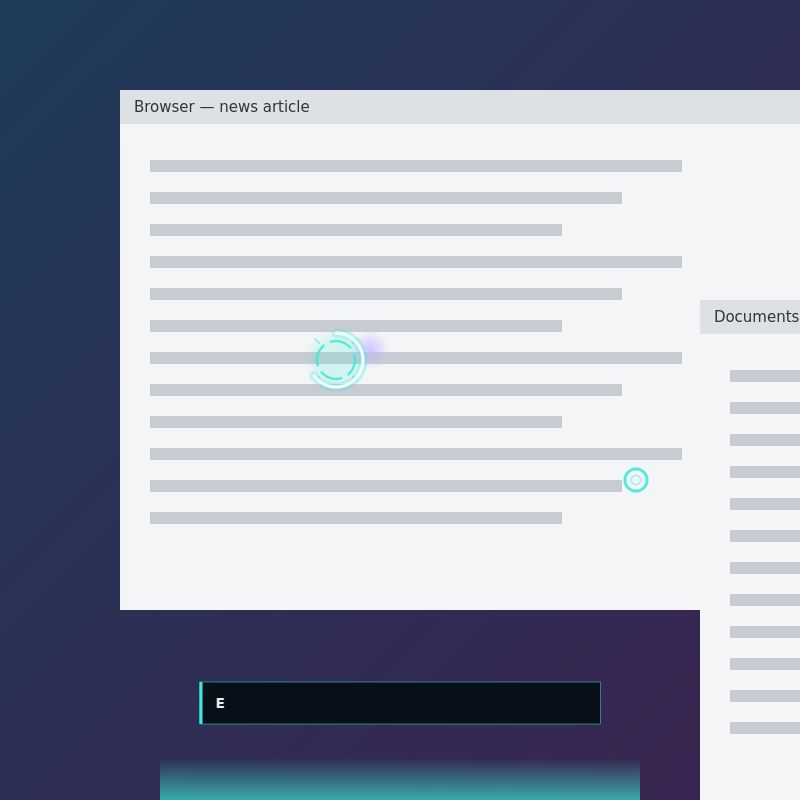 | 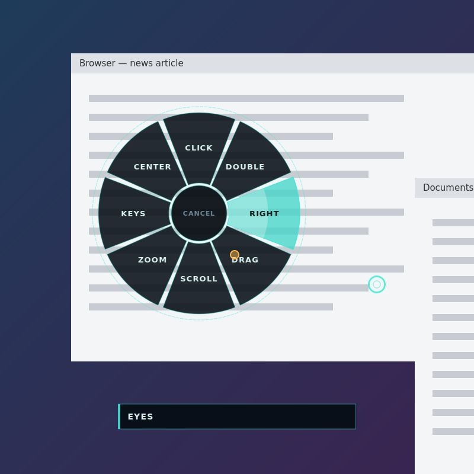 | 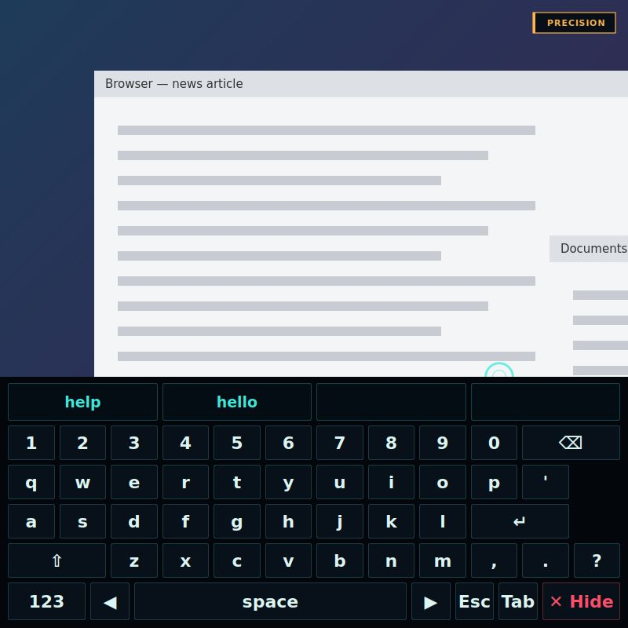 |
|---|---|---|

There's also a boot sequence (particle iris and systems check) and synthesized sound design. If a machine has no WebGL, the deck falls back to a 2D display and keeps every control.

## How it works

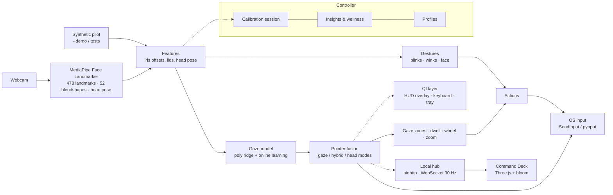

- **Gaze model.** Quadratic ridge regression on iris offsets and head pose, with cross-validated regularization and outlier rejection. It trains in milliseconds and keeps learning implicitly: every click is a labelled sample, because you were looking at what you clicked.
- **Pointing.** Pure gaze (One-Euro filter, deadband, saccade-aware), MAGIC-style hybrid (eyes jump, head refines), plus three head-only modes. Gaze modes fall back to head control until you calibrate, so the cursor never just freezes.
- **Calibration** is a UI-agnostic state machine. Samples are only taken after the eyes settle, blinks are rejected, and accuracy is measured on held-out points.
- **Everything is local.** The hub binds to `127.0.0.1` and requires a per-launch token; foreign-origin WebSocket handshakes are refused, so a web page can't drive your PC through it.

## Accuracy: what to expect

Webcam gaze tracking is typically accurate to about 1–3% of the screen width (roughly 20–60 px on a 1080p monitor) with decent lighting. That's plenty for buttons, links and tabs. For tiny targets, use the zoom lens, precision mode or hybrid mode. Tips:

- Light your face from the front. A bright window behind you is the #1 accuracy killer.
- Put the camera at the top-centre of the monitor you control.
- Recalibrate when you change seat or lighting ("Add to existing data" keeps your old samples).

## Command line

```
python -m gazer [--demo] [--real-input] [--web] [--no-browser] [--port N] [--profile NAME] [--data-dir DIR] [-v]
```

| Flag | Meaning |
|---|---|
| `--demo` | Simulated pilot instead of a webcam. Uses its own data folder and starts pre-calibrated. |
| `--real-input` | In demo mode, move your real mouse. |
| `--web` | No Qt: engine + Command Deck in your browser (no overlay or keyboard). |
| `--port` | Local port for the deck (default 8765, or the next free one). |

Global hotkeys (configurable): **Ctrl+Alt+P** pause, **Ctrl+Alt+Q** control on/off, **Ctrl+Alt+R** recenter, **Ctrl+Alt+K** keyboard, **Ctrl+Alt+M** next mode, **Ctrl+Alt+C** calibrate.

Voice (optional, fully offline): `pip install vosk sounddevice`, then download the 40 MB model from the Voice view.

## Development

```bash
QT_QPA_PLATFORM=offscreen python -m pytest -q     # 51 tests, no webcam needed
```

The tests drive the real feature pipeline with the synthetic pilot. They cover calibration accuracy, eyes-only cursor tracking, double-blink clicks, immunity to natural blinks, zones, the hub's security and protocol, and the Qt overlay and keyboard.

```
gazer/
  app.py            CLI entry (desktop / --web / --demo)
  controller.py     owns engine, profiles, calibration, voice, hotkeys, insights; command API
  server.py         local aiohttp hub: static deck + WebSocket telemetry/commands
  core/             engine, tracker, features, gaze model, pointer fusion, gestures,
                    zones, calibration session, insights, simulator, input backends
  ui/               Qt: desktop shell, HUD overlay, gaze keyboard, theme
  web/              Command Deck (vanilla ES modules, vendored three.js, OFL fonts)
docs/ANALYSIS.md    review of the original project and what changed
```

## Troubleshooting

| Problem | Fix |
|---|---|
| Camera won't open | Close Zoom/Teams; check camera privacy settings; try another index or backend in **System**. |
| "No face" | Face the camera, add front light, sit 40–80 cm away. |
| Cursor drifts | Recenter (wheel or Ctrl+Alt+R), or recalibrate. |
| Deck opens in the browser instead of a window | `pip install PyQt6-WebEngine` |
| "Performance mode" toast | Your GPU is slow: bloom is disabled automatically. Set **System → Render quality → Low** to make it permanent. |
| Linux/Wayland: clicks don't happen | pynput needs X11 (or XWayland) to inject input. |

## Credits

Face tracking by [MediaPipe](https://developers.google.com/mediapipe) (Apache 2.0; the model downloads on first run). 3D by [three.js](https://threejs.org) r170 (MIT, vendored). Fonts: Orbitron, Rajdhani and JetBrains Mono (SIL OFL, vendored). Voice by [Vosk](https://alphacephei.com/vosk/) (Apache 2.0, optional).
